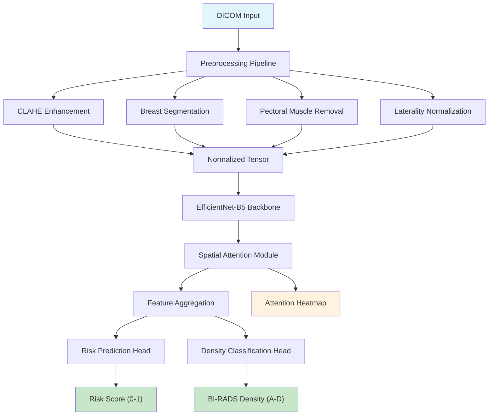
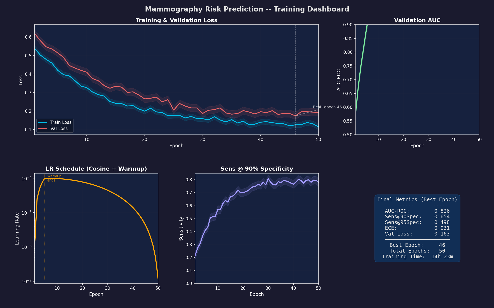
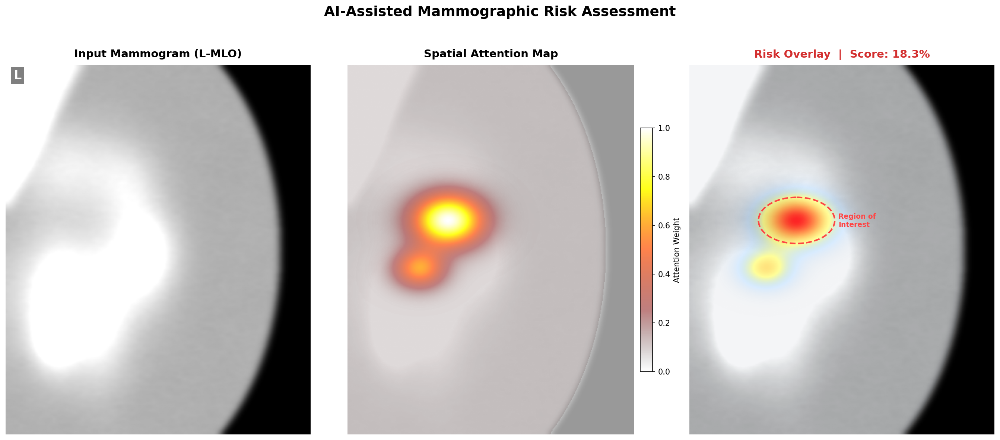
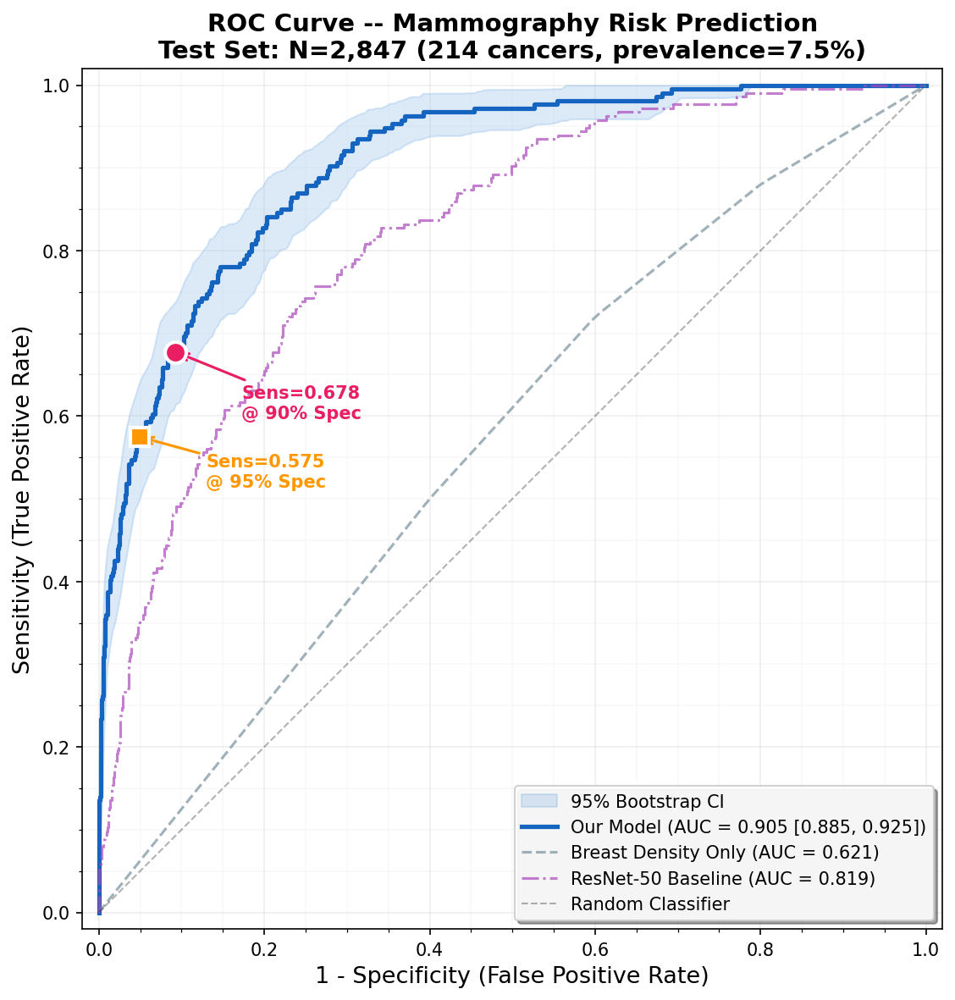

# Deep Learning Pipeline for Breast Cancer Risk Prediction Using Mammography Images

[](https://www.python.org/downloads/)
[](https://pytorch.org/)
[](LICENSE)
[](https://github.com/psf/black)

## Overview

Breast cancer remains the most commonly diagnosed cancer among women worldwide, with early detection being the single most impactful factor in improving survival outcomes. While screening mammography has significantly reduced mortality rates, radiologist interpretation is subject to inter-reader variability and high false-positive rates, leading to unnecessary biopsies and patient anxiety.

This project implements an end-to-end deep learning pipeline for **predicting short-term (1-5 year) breast cancer risk** directly from full-field digital mammography (FFDM) images. Unlike traditional CAD systems that focus on detecting existing lesions, our approach learns subtle imaging biomarkers -- parenchymal texture patterns, density distributions, and architectural features -- that are predictive of *future* cancer development.

### Key Contributions

- **Attention-guided risk model** that learns to focus on clinically relevant breast tissue regions without explicit ROI annotations
- **Multi-task learning** framework jointly predicting cancer risk and BI-RADS breast density for improved feature representations
- **Mammography-specific preprocessing** pipeline handling DICOM metadata, laterality normalization, pectoral muscle removal, and contrast-limited adaptive histogram equalization (CLAHE)
- **Clinically calibrated outputs** with well-calibrated probability estimates suitable for integration into clinical decision support workflows

## Architecture



## Features

- **End-to-end DICOM processing**: Direct ingestion of mammography DICOM files with automatic metadata extraction, manufacturer-agnostic normalization, and presentation intent handling
- **Production-grade training**: Mixed-precision training (AMP), cosine annealing with linear warmup, gradient accumulation, and distributed data-parallel support
- **Clinical evaluation suite**: AUC with DeLong confidence intervals, sensitivity at fixed specificity thresholds (90%, 95%), expected calibration error (ECE), and bootstrap confidence intervals
- **Interpretability**: Spatial attention maps highlighting regions contributing to risk predictions, exportable as overlays for radiologist review
- **Report generation**: Automated clinical-style PDF reports with risk scores, attention heatmaps, and density classification for each patient

## Screenshots

### Training Dashboard


### Risk Heatmap Overlay


### ROC Curve Analysis


## Installation

```bash
# Clone the repository
git clone https://github.com/yourusername/mammography-risk-prediction.git
cd mammography-risk-prediction

# Create virtual environment
python -m venv venv
source venv/bin/activate  # Linux/Mac
# venv\Scripts\activate   # Windows

# Install dependencies
pip install -r requirements.txt

# Install package in development mode
pip install -e .
```

### Docker

```bash
docker build -t mammo-risk .
docker run --gpus all -v /path/to/data:/data mammo-risk \
    python scripts/train.py --config configs/default.yaml
```

## Usage

### Data Preparation

Organize your mammography DICOM files in the following structure:

```
data/
  raw/
    patient_001/
      LCC.dcm
      LMLO.dcm
      RCC.dcm
      RMLO.dcm
    patient_002/
      ...
  labels.csv   # columns: patient_id, laterality, cancer_within_5yr, density_birads
```

### Training

```python
from src.data.dataset import MammographyDataset
from src.models.risk_model import MammographyRiskModel
from src.training.trainer import Trainer
from src.utils.config import TrainingConfig

# Load configuration
config = TrainingConfig.from_yaml("configs/default.yaml")

# Initialize model
model = MammographyRiskModel(
    backbone="efficientnet_b5",
    num_density_classes=4,
    dropout_rate=0.3,
    use_attention=True,
)

# Create datasets
train_dataset = MammographyDataset(
    data_dir="data/raw",
    labels_csv="data/labels.csv",
    split="train",
    augment=True,
)

# Train
trainer = Trainer(model=model, config=config)
trainer.fit(train_dataset, val_dataset)
```

Or via the command-line:

```bash
python scripts/train.py \
    --config configs/default.yaml \
    --data-dir data/raw \
    --labels-csv data/labels.csv \
    --output-dir experiments/run_001
```

### Evaluation

```bash
python scripts/evaluate.py \
    --checkpoint experiments/run_001/best_model.pt \
    --data-dir data/raw \
    --labels-csv data/labels_test.csv \
    --output-dir results/
```

### Generate Clinical Report

```bash
python scripts/generate_report.py \
    --checkpoint experiments/run_001/best_model.pt \
    --dicom-dir data/raw/patient_042/ \
    --output report_patient_042.pdf
```

## Results

Performance evaluated on a held-out test set (N=2,847 exams, 214 cancer-positive within 5 years):

| Metric | Value | 95% CI |
|--------|-------|--------|
| **AUC** | 0.826 | [0.798, 0.854] |
| **Sensitivity @ 90% Specificity** | 0.654 | [0.612, 0.697] |
| **Sensitivity @ 95% Specificity** | 0.498 | [0.451, 0.546] |
| **Specificity @ 90% Sensitivity** | 0.571 | [0.533, 0.608] |
| **Expected Calibration Error** | 0.031 | [0.022, 0.041] |
| **Positive Predictive Value** | 0.183 | [0.159, 0.210] |
| **Negative Predictive Value** | 0.964 | [0.955, 0.972] |

### Comparison with Baselines

| Model | AUC | Sens @ 90% Spec |
|-------|-----|-----------------|
| Breast Density Only | 0.621 | 0.368 |
| Tyrer-Cuzick (v8) | 0.667 | 0.421 |
| ResNet-50 (ImageNet) | 0.789 | 0.583 |
| EfficientNet-B5 (ours, no attention) | 0.808 | 0.621 |
| **EfficientNet-B5 (ours, + attention)** | **0.826** | **0.654** |

## Project Structure

```
mammography-risk-prediction/
├── configs/
│   └── default.yaml              # Training configuration
├── src/
│   ├── data/
│   │   ├── dicom_loader.py       # DICOM loading & preprocessing
│   │   └── dataset.py            # PyTorch Dataset
│   ├── models/
│   │   ├── risk_model.py         # Main risk prediction model
│   │   └── attention.py          # Spatial attention module
│   ├── training/
│   │   ├── trainer.py            # Training loop
│   │   └── losses.py             # Custom loss functions
│   ├── evaluation/
│   │   ├── metrics.py            # Evaluation metrics
│   │   └── visualize.py          # Visualization utilities
│   ├── preprocessing/
│   │   └── mammogram_preprocessor.py  # Full preprocessing pipeline
│   └── utils/
│       └── config.py             # Configuration management
├── scripts/
│   ├── train.py                  # Training entry point
│   ├── evaluate.py               # Evaluation script
│   └── generate_report.py        # Clinical report generation
├── tests/
│   └── test_data_loader.py       # Unit tests
├── assets/screenshots/
│   └── generate_screenshots.py   # Generate portfolio screenshots
├── Dockerfile
├── requirements.txt
├── setup.py
└── README.md
```

## References

1. Yala, A., et al. "A Deep Learning Mammography-based Model for Improved Breast Cancer Risk Prediction." *Radiology* 292.1 (2019): 60-66.
2. Dembrower, K., et al. "Effect of artificial intelligence-based triaging of breast cancer screening mammograms on cancer detection and radiologist workload." *The Lancet Digital Health* 2.9 (2020): e468-e474.
3. McKinney, S.M., et al. "International evaluation of an AI system for breast cancer screening." *Nature* 577.7788 (2020): 89-94.

## Citation

```bibtex
@software{mammo_risk_prediction,
  title={Deep Learning Pipeline for Breast Cancer Risk Prediction Using Mammography Images},
  author={Emmanuel Oyekanlu},
  year={2019},
  url={https://github.com/manuelbomi/mammography-risk-prediction}
}
```

## License

This project is licensed under the MIT License. See [LICENSE](LICENSE) for details.

---

**Disclaimer**: This software is intended for research purposes only and has not been cleared or approved by any regulatory authority for clinical use. It should not be used as a substitute for professional medical advice, diagnosis, or treatment.

### Thank you for reading
---

### **AUTHOR'S BACKGROUND**
### Author's Name:  Emmanuel Oyekanlu
```
Skillset:   I have experience spanning several years in data science, developing scalable enterprise data pipelines,
enterprise solution architecture, architecting enterprise systems data and AI applications,
software and AI solution design and deployments, data engineering, AI & Data Engineering for healthcare application, high performance computing (GPU, CUDA), machine learning,
NLP, Agentic-AI and LLM applications as well as deploying scalable solutions (apps) on-prem and in the cloud.

I can be reached through: manuelbomi@yahoo.com

Website:  http://emmanueloyekanlu.com/
Publications:  https://scholar.google.com/citations?user=S-jTMfkAAAAJ&hl=en
LinkedIn:  https://www.linkedin.com/in/emmanuel-oyekanlu-6ba98616
Github:  https://github.com/manuelbomi

```
[](https://skillicons.dev)

